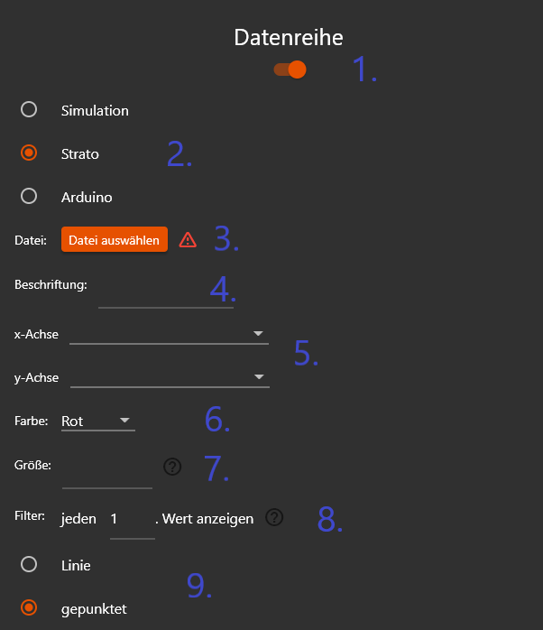

# Anleitung Datenauswertungsprogramm
Mit dem Datenauswertungsprogramm lassen sich individuelle Aufstiegssimulationen erstellen und die gemessenen Daten der auf dem Stratosphärenflug mit geflogenen Datenlogger und der Simulation grafisch darstellen.

Dieses Programm ist nur für Windows entwickelt und funktioniert nicht auf macOS.

## Funktionen
- **Formatieren** von Rohdateien der Datenlogger 
- **Simulieren** des Aufstiegs
- **Grafisch darstellen** der Messwerte

## Herunterladen und Starten:
1. Um das Programm verwenden zu können, benötigst Du den gesamten Ordner mit dem Namen `Datenauswertungsprogramm`. Diesen bekommst Du bei Deinem Lehrer oder auf Github unter dem Link: `https://github.com/0x4c46/Datenauswertung-Stratosphaerenballonflug/releases/latest` (Die `.zip`-Datei herunterladen).
3. Ist der Name des Ordners `Datenauswertungprogramm.zip`, musst Du diesen erst entpacken, indem Du den Ordner auswählst, einen Rechtsklick darauf machst und auf `alle extrahieren` klickst.
5. Um das Programm nun zu starten, muss in dem Ordner die Datei `Datenauswertung.exe` gestartet werden (Doppelklick).
Sollte beim Starten des Programms der Windows Defender anschlagen und vor dem Programm warnen, musst Du auf `Weitere Informationen` klicken und dann auf `trotzdem ausführen`.

Sollte auf Deinem Computer ein anderes Antivirenprogramm beim Start des Programmes warnen, versuche, dieses zu umgehen. 
Es wird gewarnt, da das Datenauswertungsprogramm selbst entwickelt wurde und kein offizielles Zertifikat besitzt. Daher wird es als potenzielle Gefahr erkannt. Dieses Programm ist allerdings absolut sicher. Es greift **nicht** in den Computer ein und hat auch **keinen** Zugriff auf das Internet.

**Achtung:**
Es ist wichtig, dass die Ordnerstruktur in dem Ordner `Datenauswertungsprogramm` nicht verändert wird. Es darf keine Datei aus dem Ordner entfernt oder verändert werden. Sollte es dennoch passieren und das Programm dadurch nicht mehr funktionieren, muss der Ordner neu heruntergeladen werden.

## Formatieren der Rohdaten:
Mit dem linken Tab im Programm lassen sich Dateien formatieren, die vom Strato3 und dem Arduino geschrieben wurden. Dabei werden beispielsweise Messungen entfernt, bei denen der Strato3 kein GPS-Signal hatte oder der Ballon noch nicht gestartet bzw. schon gelandet ist.

1. Wähle aus, ob Du eine Datei vom Strato3 oder vom Arduino formatieren möchtest.
2. Wähle die Datei aus. Diese Datei muss die rohe, nicht veränderte Datei vom Datenlogger sein.
3. Gib den Ordner an, in dem die formatierte Datei gespeichert werden soll.
4. In das Textfeld `Dateiname` wird der Name der formatierten Datei ohne Dateiendung eingegeben. Der Name ist frei wählbar.
5. Ist die Checkbox ausgefüllt,  muss die Start-/Landeuhrzeit selbstständig angegeben werden. Bei Dateien des Strato3 kann die Start-/Landeuhrzeit automatisch berechnet werden (Checkbox nicht ausgefüllt), beim Arduino muss die Uhrzeit angegeben werden.
6. Um die Messwerte mit diesem Programm grafisch darzustellen, muss das Trennzeichen ein Komma sein.  Möchtest Du Dir die Messwerte später mit Excel anschauen, ist es sinnvoll, als Trennzeichen ein Semikolon (`;`) zu verwenden.
7. Sind alle notwendigen Felder ausgefüllt, erscheint der `Run`-Button. Wenn Du darauf klickst, startet die Formatierung. Unterhalb des Buttons wirst Du über den Stand der Aktion hingewiesen und mögliche Fehler werden dort angezeigt.

## Simulieren:
Mithilfe des mittleren Tabs kann eine Simulation des Aufstiegs erstellt werden. 

1.  Wähle aus, ob Du eine rein physikalische Simulation erstellen möchtest oder eine, bei der Erfahrungswerte letzter Flüge verwendet werden.
1.  Gib den Ordner an, in dem die Datei mit der Simulation gespeichert werden soll.
2.  In das Textfeld `Dateiname` wird der Name der Datei ohne Dateiendung eingegeben. Der Name ist frei wählbar.
3.  Hier wird das Heliumvolumen eingegeben. Beachte, dass dies in der Einheit Kubikmeter [$m^3$] angegeben werden muss und das Dezimaltrennzeichen ein **Punkt** ist.
4.  Gib an, wie schwer die Nutzlast ist, die der Ballon in den Himmel trägt. Hier wird nur die Masse der Sonde mit Schnur und Fallschirm angegeben, **nicht** die Masse des Ballons oder des Heliums.
5.  Nun wird das Abbruchkriterium angegeben, bei dem die Simulation beendet wird. Dies kann entweder ein Ballonradius sein oder eine bestimmte Höhe. Den Radius, bei dem der Wetterballon platzt, findest Du, wenn Du mit der Maus über das Fragezeichen hoverst. 
6.  Sind alle notwendigen Felder ausgefüllt, erscheint der `Run`-Button. Wenn Du darauf klickst, startet die Berechnung. Unterhalb des Buttons wirst Du über den Stand der Aktion hingewiesen und mögliche Fehler werden dort angezeigt.

## Grafisch darstellen:
Hier werden die Messwerte und die Simulation visualisiert und in anschaulichen Graphen dargestellt.

1. Titel eingeben.
2. Auswählen, ob ein zwei- oder dreidimensionaler Graph erstellt werden soll.
3. Soll nur der Aufstieg dargestellt werden, muss diese Checkbox ausgefüllt werden. Diese Funktion funktioniert nur bei der Simulation und dem Strato3, da beim Arduino keine Höhendaten aufgezeichnet werden und so nicht festgestellt werden kann, wann der Ballon platzt.

Nun werden die einzelnen Datenreihen ausgewählt, die in dem Graphen dargestellt werden sollen.

1. Jede Datenreihe, die verwendet wird muss zuerst aktiviert werden. Hierbei müssen die Datenreihen von links nach rechts verwendet werden, d.h. soll nur eine Datenreihe dargestellt werden, muss die linke Datenreihe verwendet werden, und als zweite die Mittlere.
2. Auswählen, welche Art von Messwerte verwendet werden.
3. Datei auswählen, aus der die Messwerte entnommen werden sollen. Die ausgewählte Datei muss vorher mit diesem Programm formatiert worden sein. Ist eine Datei ausgewählt, erscheint ein grüner Haken.
4. Beschriftung der Datenreihe, die in der Legende angezeigt wird.
5. Auswählen, welche Messwerte auf der jeweiligen Achse dargestellt werden soll. Soll ein dreidimensionaler Graph erstellt werden, erscheint eine Auswahlmöglichkeit zusätzlich für die z-Achse.
6. Auswählen der Farbe, in der die Datenreihe dargestellt werden soll.
7. Eingeben der Größe der Datenpunkte bzw. Liniendicke. Werte zwischen 1 und 10 sind empfehlenswert.
7. Dieser Wert gibt an, jeder wievielter Wert angezeigt werden soll. Soll die Simulation dargestellt werden, ist es sinnvoll, nur jeden 100. Wert darzustellen, da das Programm ansonsten sehr langsam werden kann. 
8. Auswählen, ob die einzelnen Punkte verbindet werden sollen, oder nur einzelne Punkte dargestellt werden sollen.

Sind alle notwendigen Felder ausgefüllt, erscheint der `Run`-Button. Wenn Du darauf klickst, öffnet sich nach einigen Sekunden folgendes Fenster, in dem der Graph angezeigt wird. Unterhalb des Buttons werden mögliche Fehler angezeigt.

Ist der Button mit dem Kreuz (1.) ausgewählt, kannst Du den Graphen verschieben, mit der Lupe (2.) kann man mit der linken Maustaste einen Bereich markieren, der herangezoomt wird, mit der rechten kann man herauszoomen. Zum Speichern des Diagramms muss auf die Speicherdiskette geklickt werden. Dort kann das Diagramm unter anderem als Bild (`.png`) gespeichert werden. Das Diagramm wird immer so gespeichert, wie es zu sehen ist, auch wenn herangezoomt wurde.
